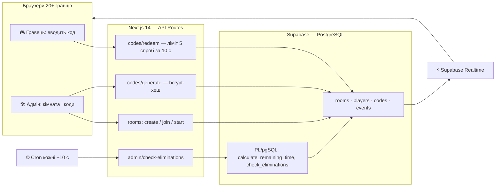

# TIMER — Lobby Timer Game

Мультиплеєрна веб-гра на вибування: у кожного гравця тане серверний таймер, одноразові коди додають або крадуть час, хто дійшов до нуля — вибув.

> **TL;DR (EN):** Real-time multiplayer elimination game: each player's server-side timer ticks down, single-use codes add, steal or share time, last player standing wins. Next.js 14 + TypeScript + Supabase (PostgreSQL, Realtime, PL/pgSQL).

## Що це таке, простими словами?

Уяви «гарячу картоплю», тільки замість картоплі — час. Кожен гравець на старті отримує, скажімо, 20 хвилин, і його персональний годинник одразу починає танути. Врятуватися можна секретними кодами, які роздає ведучий: один докидає п'ять хвилин тобі, інший краде час у суперника, третій доливає всім у кімнаті одразу. Кожен код спрацьовує лише раз — як квиток, який компостують. У кого годинник дійшов до нуля — той вибув; останній, у кого ще лишився час, перемагає.

Хитрість у тому, що «справжній» час рахує не твій телефон, а сервер — *єдине джерело істини*: навіть якщо перекрутити годинник на своєму пристрої, гру це не обдурить. А про кожну зміну всі екрани дізнаються миттєво через *realtime-канал* — постійне з'єднання, яким сервер сам «штовхає» новини в браузер.

## Як це влаштовано



## Можливості

- Лобі-система: приєднання до кімнати за коротким кодом, розраховано на 20+ одночасних гравців
- Серверний таймер як єдине джерело істини, синхронний старт для всіх (±1 с)
- 4 типи одноразових кодів: додати собі, відняти собі, вкрасти в іншого, додати всім
- Автоматичне вибуття при 0 секунд і визначення переможця, коли лишається один живий гравець
- Realtime-оновлення через Supabase: нові гравці, старт гри, використані коди, вибуття
- Захист: коди зберігаються як bcrypt-хеш, rate limiting 5 спроб за 10 с на гравця, admin-ключі не потрапляють на клієнт, Row Level Security в PostgreSQL
- Append-only журнал подій (`events`) — повний аудит-лог гри
- 7 API endpoints, 4 таблиці, 2 PL/pgSQL-функції, 11 індексів

## Чому це цікаво технічно

- **Час ніде не зберігається як число — він обчислюється.** Залишок часу гравця виводиться з append-only журналу подій (event sourcing у мініатюрі), тому конкурентні активації кодів не затирають одна одну:

  ```
  elapsed   = now_server - started_at
  adjust    = SUM(events.time_delta_seconds WHERE target = player)
  remaining = base_seconds - elapsed + adjust
  ```

- **Логіка живе поруч із даними.** `calculate_remaining_time` і `check_eliminations` — це PL/pgSQL-функції в PostgreSQL: перевірка вибуття і вибір переможця виконуються однією RPC, без раунд-трипів між сервером і базою.
- **Клієнт лише малює.** Браузер анімує зворотний відлік локально, але кожне рішення (чи код валідний, чи гравець живий, скільки часу лишилось) приймає сервер — читерство через девтулзи не працює.
- **Коди — як паролі.** В базі лежить тільки bcrypt-хеш; при активації введений код порівнюється з хешами невикористаних кодів кімнати, а одноразовість фіксується полем `used_at`.

## Як запустити

### 1. Залежності

```bash
npm install
```

### 2. Supabase

1. Створіть проект на [supabase.com](https://supabase.com)
2. Виконайте SQL з файлу `supabase-schema.sql` у SQL Editor
3. Створіть файл `.env.local` у корені (на Windows можна скористатися `create-env.ps1`):

```env
NEXT_PUBLIC_SUPABASE_URL=https://your-project.supabase.co
NEXT_PUBLIC_SUPABASE_ANON_KEY=your-anon-key
SUPABASE_SERVICE_ROLE_KEY=your-service-role-key
CRON_SECRET=your-secret-key
```

### 3. Dev-сервер

```bash
npm run dev
```

Відкрийте [http://localhost:3000](http://localhost:3000). Інші скрипти: `npm run build`, `npm run start`, `npm run lint`.

### 4. Періодична перевірка вибуття

Гравці з нульовим часом вибувають, коли спрацьовує перевірка. Локально її ганяє loop-скрипт:

```bash
node scripts/check-eliminations-loop.js
```

У проді — cron, що смикає endpoint (деталі в `scripts/setup-cron.md`):

```bash
curl -X POST http://your-domain.com/api/admin/check-eliminations \
  -H "Content-Type: application/json" \
  -d '{"secret": "your-secret"}'
```

### Деплой (Vercel)

```bash
npm install -g vercel
vercel
```

В Environment Variables Vercel додайте ті самі змінні, що в `.env.local`.

## Як користуватися

**Адміністратор:** створює кімнату («Create New Room (Admin)»), задає стартовий час (за замовчуванням 20 хв), ділиться Room Code, генерує коди на панелі адміна, натискає «Start Game».

**Гравець:** вводить Room Code та ім'я, чекає старту в лобі, після старту вводить коди, щоб виграти час — і намагається пережити інших.

## Типи кодів

| effect_type | Що робить | Приклад payload |
|---|---|---|
| `self_add` | +час собі | `{ "seconds": 300 }` |
| `self_subtract` | −час собі (коди-пастки) | `{ "seconds": -300 }` |
| `team_add` | +час усім у кімнаті | `{ "seconds": 300, "scope": "all" }` |
| `steal` | забрати час у конкретного гравця | `{ "from_player_id": "uuid", "seconds": 300 }` |

## API

| Method | Endpoint | Опис |
|--------|----------|------|
| POST | `/api/rooms/create` | Створити кімнату |
| POST | `/api/rooms/join` | Приєднатися до кімнати |
| POST | `/api/rooms/start` | Запустити гру (admin) |
| GET | `/api/rooms/:id/state` | Отримати стан кімнати |
| POST | `/api/codes/redeem` | Використати код |
| POST | `/api/codes/generate` | Згенерувати коди (admin) |
| POST | `/api/admin/check-eliminations` | Перевірити вибуття (cron) |

## База даних

- **rooms** — кімнати: `room_code`, статус (lobby/running/finished), `admin_key`, `base_seconds`, переможець
- **players** — гравці: імʼя, `is_admin`, `eliminated_at`
- **codes** — одноразові коди: `code_hash` (bcrypt), `effect_type`, `payload` (JSONB), `used_at`
- **events** — append-only журнал: тип події, актор, ціль, `time_delta_seconds`

Всі таблиці підключені до `supabase_realtime` publication.

## Документація в репо

Покроковий гайд для новачків — **[START_HERE.md](START_HERE.md)**; швидкий старт за 5 хвилин — **[QUICK_START.md](QUICK_START.md)**; деталі архітектури — **[ARCHITECTURE.md](ARCHITECTURE.md)**; налаштування — **[SETUP.md](SETUP.md)**.

## Стан проекту

Це MVP, зібраний за короткий спринт (39 комітів). Чесний зріз:

**Працює:** лобі, синхронний старт, генерація й активація всіх 4 типів кодів, realtime-оновлення, автовибуття, визначення переможця — все перевірено локально.

**Ще ні / компроміси MVP:**
- Демо ще не задеплоєне — запуск поки тільки локальний
- Rate limiter — це in-memory `Map` в API-роуті: на одному інстансі працює, на serverless-платформі обнуляється між холодними стартами
- Активація коду — послідовність запитів до бази, а не одна транзакція; для проду логіку redeem варто перенести в одну PL/pgSQL-функцію
- Enum ефектів у схемі містить п'ятий тип `temptation`, який redeem поки не обробляє
- `npm run db:setup` посилається на `scripts/setup-db.js`, якого немає в репо — схему заливайте через SQL Editor (крок 2 вище)
- Автотестів немає

## Ліцензія

MIT
